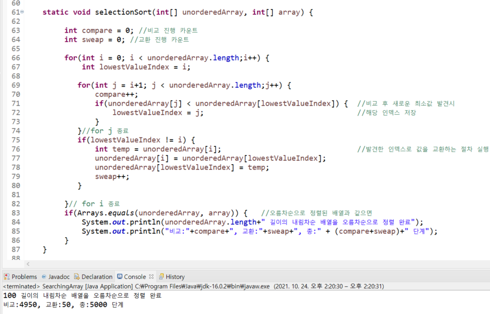

# Java Practice And Puzzles
### Java 언어의 문법을 익히고 응용해보는 곳입니다.
---
### 1. Practice : 기본 문법을 익히고 기초를 연습 및 응용
### 2. Puzzles : 자료구조 및 알고리즘
#### 2.1 배열
- 1,000,000개의 데이터가 순서와 상관없이 저장된 배열에서 값을 찾기 위해서 몇 단계의 연산이 필요할까? 최악의 경우 가장 뒤에서 찾게되어 1,000,000 단계의 연산이 필요하다. 
- 이처럼 정렬되지 않은 배열을 검색하려면 처음부터 하나씩 순서대로 찾아보는 방법을 사용하게 되는데 배열의 크기가 커질수록 검색 단계가 비례하여 증가한다. 

- 배열이 정렬되어있다면 빠르고 간편하게 검색을 할 수 있기 때문에 오름차순으로 정렬하는 방법이 필요하다.
- 정렬된 배열에서는 이진 검색이 가능하다. 배열의 중간 인덱스의 값과 찾고자 하는 값을 비교한 후 검색 범위를 계속 조정해나가는 방식으로 빠르게 검색이 가능하다. 

|BinarySearchCode|콘솔창|
|:-:|:-:|
|||

### 2.2 배열을 정렬하는 방법
### 1. Bubble Sort (버블정렬)
- 오름차순으로 정렬하고 싶을 때 내림차순정렬의 배열은 약 n^2 의 연산단계가 필요하다. 데이터 수가 증가할 수록 연산 단계 수가 기하급수적으로 증가함.  

### 2. Selection Sort(선택정렬)
- 선택정렬은 교환단계의 연산을 필요시에만 수행하게 하여 연산 절차를 간소화하였다. 

|버블정렬|선택정렬|
|:-:|:-:|
|||

### 3. Insersion Sort (삽입정렬)
- 삽입정렬은 내림차순으로 정렬되있는 최악의 상황에서는 선택 정렬과 비슷한 효율을 보인다. 
- 그러나 배열이 오름차순에 가깝게 데이터가 위치하고 있는 경우 긍정적인 시나리오 상에서는 더 효율적일 수도 있다. 
- 선택정렬은  긍정적인 상황과 최악의 상황의 효율이 동일하지만 삽입정렬은 긍정적인 상황이라면 연산단계가 매우 효율적으로 감소될 수 있다.  
- 배열의 크기를 100으로 정하고 오름차순정렬에서 처음과 끝의 인덱스 값만 바꾼 긍정적인 상황일 경우 선택정렬보다 삽입정렬이 매우 효율적이다.  

|삽입정렬 (5049단계) |선택정렬 (5000단계)|
|:-:|:-:|
|||

- 배열의 크기가 커질수록 차이는 극명해진다. 배열의 크기를5000으로 가정시의 필요 연산 단계이다. 

|삽입정렬(14,996단계)|선택정렬 (12,497,501단계)|
|:-:|:-:|
|||
